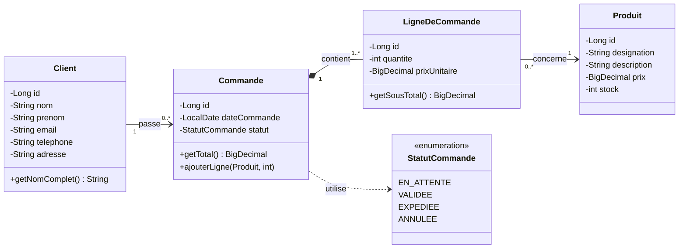

# Class diagram

Rendered natively by GitHub (Mermaid). The LaTeX/TikZ version used in the report is
[`class-diagram.tex`](class-diagram.tex).

```mermaid
classDiagram
    direction LR

    class Client {
        -Long id
        -String nom
        -String prenom
        -String email
        -String telephone
        -String adresse
        +getNomComplet() String
    }

    class Commande {
        -Long id
        -LocalDate dateCommande
        -StatutCommande statut
        +getTotal() BigDecimal
        +ajouterLigne(Produit, int)
    }

    class LigneDeCommande {
        -Long id
        -int quantite
        -BigDecimal prixUnitaire
        +getSousTotal() BigDecimal
    }

    class Produit {
        -Long id
        -String designation
        -String description
        -BigDecimal prix
        -int stock
    }

    class StatutCommande {
        <<enumeration>>
        EN_ATTENTE
        VALIDEE
        EXPEDIEE
        ANNULEE
    }

    Client "1" --> "0..*" Commande : passe
    Commande "1" *-- "1..*" LigneDeCommande : contient
    LigneDeCommande "0..*" --> "1" Produit : concerne
    Commande ..> StatutCommande : utilise
```
